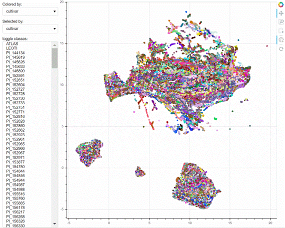

# Embedding Visualization Tool
This tool is designed to help users understand high-dimensional data with multiple labels through intuitive visualizations. It offers flexible colormap customization and highlighting options to make data exploration more effective. 
## Key features:
* Dynamic Colormap Customization: Easily change colormap based on different labels. 
* Highlight Functionality: Highlight individual or multiple classes for focused analysis. 
* Cross-Label Structure Discovery: Visualize and explore high-dimensional data structures across labels with enhanced clarity using different colormaps and highlights.
* Hover to the point to view the data point labels or the image

## Demo:

_built with bokeh_